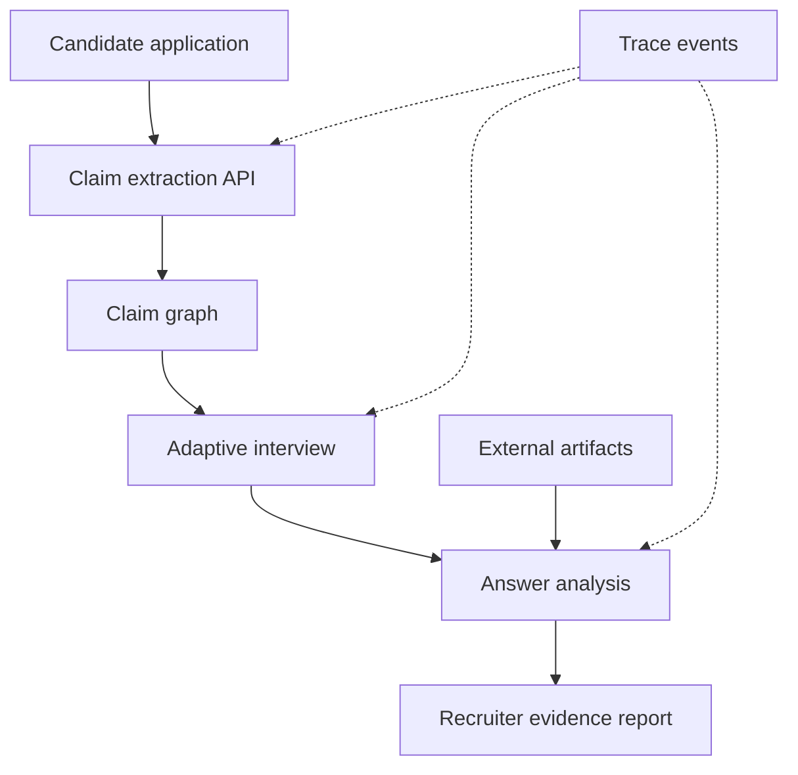

# ClaimProof — Four-Person Hackathon Build Plan

## 1. Product in One Sentence

ClaimProof converts a candidate's application into a graph of testable claims, conducts a short adaptive interview about those claims, and gives recruiters an auditable claim-by-claim evidence report.

## 2. Four-Hour Demo Goal

By the end of the build, the team must be able to demonstrate one complete path:

1. A candidate uploads a resume or starts from the seeded demo resume.
2. The system extracts 3–5 important claims and displays them as a claim graph.
3. The candidate starts an interview and receives a question tied to one selected claim.
4. The candidate answers by voice; the application records/transcribes the response.
5. The system asks one adaptive follow-up based on the answer.
6. The analysis connects answer excerpts and optional external artifacts to the claim.
7. A recruiter opens a report showing what was claimed, what was demonstrated, what external evidence was found, and what remains unresolved.
8. The team shows an observable trace from claim extraction through the final assessment.

The product does **not** infer honesty, integrity, competence, or employability from facial expression, eye contact, accent, vocal tone, or other biometric/behavioral signals. Audio/video may support the interview experience, but only answer content and explicit evidence enter the report.

## 3. Definition of Done

The MVP is done when all of the following work in one rehearsed browser flow:

- [ ] One seeded application can be loaded without relying on an upload or third-party service.
- [ ] At least three structured claims appear for the candidate.
- [ ] Every displayed interview question identifies its source `claim_id`.
- [ ] At least one answer can be recorded or entered, transcribed or submitted, and saved.
- [ ] At least one answer produces a context-aware follow-up question.
- [ ] The recruiter report links each finding to a claim, question, and answer excerpt.
- [ ] The report uses evidence categories, not a deceptive “truth score.”
- [ ] One external artifact or controlled mock artifact can be attached to a claim.
- [ ] One end-to-end trace or local event timeline can be shown.
- [ ] The happy-path demo works even if sponsor APIs or live LLM calls fail.

## 4. Architecture and Ownership



| Person | Primary ownership | Must deliver | Can develop against |
|---|---|---|---|
| 1 — Backend/AI lead | Shared schemas, claim extraction, question generation, answer analysis, API | Working API plus deterministic fallback fixtures | Local API tests and seeded request JSON |
| 2 — Candidate experience | Upload/seed flow, claim-graph view, interview UI, audio/text answer capture | Candidate flow through completed interview | Mock API responses frozen at kickoff |
| 3 — Recruiter experience | Candidate list, claim evidence report, source excerpts, unresolved questions | Recruiter dashboard and demo-ready report | Seeded `report.json` fixture |
| 4 — Evidence/reliability lead | External artifact investigation, tracing/observability, fixtures, integration tests, demo controls | Evidence adapter, trace view/instrumentation, reliable demo scenario | Seeded claims and controlled evidence pages/files |

### File ownership

Each person owns separate directories during the parallel phase:

```text
backend/                         Person 1
  app/
  tests/
frontend/app/candidate/         Person 2
frontend/components/interview/  Person 2
frontend/app/recruiter/         Person 3
frontend/components/report/     Person 3
integrations/                   Person 4
fixtures/                       Person 4, after schemas are frozen
docs/                           Person 4
shared/                         Changes require team agreement
```

Avoid editing another person's owned directory during the first three hours. Shared contract changes require a message to the entire team and an update to the fixtures in the same commit.

## 5. First 20 Minutes: Freeze the Contract Together

All four people do this before separating.

1. Confirm the demo candidate, role, and three core claims.
2. Create the repository structure and four branches/worktrees.
3. Freeze the data shapes below in `shared/contracts.ts` and/or `backend/app/schemas.py`.
4. Put matching example payloads in `fixtures/`.
5. Agree on the API base URL, CORS configuration, and environment-variable names.
6. Confirm which integrations have credentials; every integration must have a fixture fallback.
7. Run a mock candidate-to-report flow using only fixture JSON.

Recommended branches:

```text
feat/backend-ai
feat/candidate-ui
feat/recruiter-ui
feat/evidence-observability
```

Do not independently rename shared fields after this checkpoint.

## 6. Shared Data Contract

### Core entities

```ts
type Claim = {
  id: string;
  candidate_id: string;
  source_document: "resume" | "transcript" | "cover_letter" | "other";
  source_excerpt: string;
  category: "project" | "employment" | "education" | "skill" | "impact";
  statement: string;
  importance: "high" | "medium" | "low";
  entities: string[];
};

type InterviewQuestion = {
  id: string;
  claim_id: string;
  text: string;
  kind: "opening" | "follow_up";
  intent: string;
};

type InterviewAnswer = {
  id: string;
  question_id: string;
  transcript: string;
  audio_url?: string;
  created_at: string;
};

type EvidenceItem = {
  id: string;
  claim_id: string;
  type: "interview_excerpt" | "document_excerpt" | "external_artifact";
  source_label: string;
  excerpt: string;
  source_url?: string;
  supports: string;
  limitations: string;
};

type ClaimAssessment = {
  claim_id: string;
  status: "demonstrated" | "partially_demonstrated" | "unresolved";
  rationale: string;
  evidence_ids: string[];
  unresolved_questions: string[];
};

type CandidateReport = {
  candidate_id: string;
  role_title: string;
  claims: Claim[];
  questions: InterviewQuestion[];
  answers: InterviewAnswer[];
  evidence: EvidenceItem[];
  assessments: ClaimAssessment[];
};
```

### Interpretation rules

- `demonstrated` means the candidate provided a relevant, technically specific explanation during this interview. It does not prove authorship or truth.
- `partially_demonstrated` means the answer addressed part of the claim but left a material detail unsupported.
- `unresolved` means the interview did not gather enough relevant evidence.
- External project evidence can show that an artifact exists and matches a description; it cannot by itself prove that the candidate authored it.
- The UI must show the `limitations` field whenever it shows supporting evidence.

## 7. API Contract

| Method | Endpoint | Purpose | Owner |
|---|---|---|---|
| `POST` | `/api/applications` | Create application from upload or seeded text | Person 1 |
| `POST` | `/api/applications/{id}/extract-claims` | Return structured claims | Person 1 |
| `GET` | `/api/candidates/{id}/claims` | Load claim graph | Person 1 |
| `POST` | `/api/interviews` | Start interview for selected claims | Person 1 |
| `GET` | `/api/interviews/{id}/next-question` | Return opening or follow-up question | Person 1 |
| `POST` | `/api/interviews/{id}/answers` | Store transcript and return next action | Person 1 |
| `POST` | `/api/claims/{id}/evidence` | Attach external or document evidence | Persons 1 and 4 |
| `POST` | `/api/interviews/{id}/complete` | Generate assessments and report | Person 1 |
| `GET` | `/api/candidates/{id}/report` | Return complete recruiter report | Person 1 |
| `GET` | `/api/traces/{session_id}` | Return local fallback trace timeline | Person 4 |

If a live backend is unavailable, the frontend must switch to `DEMO_MODE=true` and read the same response shapes from `fixtures/`.

## 8. Parallel Workstreams

### Person 1 — Backend, Claim Graph, and AI Reasoning

#### Goal

Provide the stable application brain: turn documents into claims, claims into questions, answers into follow-ups, and collected evidence into bounded assessments.

#### Tasks

- [ ] Initialize FastAPI and enable CORS for the frontend origin.
- [ ] Implement Pydantic models matching the shared contract.
- [ ] Seed one candidate and role for instant demo reset.
- [ ] Implement text/PDF extraction; degrade gracefully to pasted text or seed data.
- [ ] Implement structured claim extraction with strict JSON output.
- [ ] Rank claims and cap the interview at three core claims.
- [ ] Generate one opening question per selected claim.
- [ ] Generate one adaptive follow-up from the answer transcript.
- [ ] Analyze answers into the three allowed statuses.
- [ ] Include exact transcript excerpts and evidence IDs in every assessment.
- [ ] Add deterministic fixture fallbacks for all LLM-produced objects.
- [ ] Write endpoint smoke tests for the happy path.

#### Prompt constraints

All model outputs must:

- conform to a schema;
- avoid inferring honesty, personality, emotion, or employability;
- quote or reference actual input evidence;
- state limitations;
- return `unresolved` when evidence is insufficient;
- never invent external verification.

#### Deliverable at minute 120

The backend can accept the seeded resume, return claims, conduct a two-question exchange, and return a valid `CandidateReport` via API or fixtures.

### Person 2 — Candidate Claim Graph and Interview Experience

#### Goal

Create the strongest live-demo moment: the candidate sees their application become claims and then answers a personalized, adaptive interview.

#### Tasks

- [ ] Build landing/upload screen with a prominent “Load demo candidate” control.
- [ ] Accept resume upload but keep pasted text/seed data as fallback.
- [ ] Build claim graph/cards grouped by project, employment, education, and impact.
- [ ] Let the candidate select or review the three claims chosen for interview.
- [ ] Build interview screen with one question at a time.
- [ ] Capture microphone audio where browser support permits.
- [ ] Always provide a text-answer fallback.
- [ ] Show live/final transcript and allow correction before submission.
- [ ] Display “Why this was asked” using the source claim.
- [ ] Show progress: `Claim 1 of 3`, opening question, then follow-up.
- [ ] Add loading, API failure, microphone-denied, and demo-mode states.
- [ ] On completion, route to a neutral confirmation page rather than showing a candidate score.

#### Deliverable at minute 120

The complete candidate flow works against mock responses, including one adaptive-looking follow-up and a clean handoff to the recruiter report.

### Person 3 — Recruiter Dashboard and Evidence Report

#### Goal

Make ClaimProof visibly different from a generic AI interviewer by presenting inspectable, claim-level evidence rather than a black-box score.

#### Tasks

- [ ] Build a small candidate queue with one demo candidate ready for review.
- [ ] Build a summary showing claim counts by assessment status.
- [ ] Build the primary claim report table/cards.
- [ ] For each claim, show:
  - original source excerpt;
  - question asked;
  - relevant answer excerpt;
  - external evidence, if any;
  - assessment and rationale;
  - limitations and unresolved questions.
- [ ] Add filters for `demonstrated`, `partially_demonstrated`, and `unresolved`.
- [ ] Build a detail drawer/timeline connecting claim → question → answer → evidence → assessment.
- [ ] Label AI output as decision support, not a hiring decision.
- [ ] Add an export/print button only if core report flow is complete.
- [ ] Ensure no global authenticity, honesty, emotion, or employability score appears.

#### Deliverable at minute 120

The recruiter can open the seeded report, inspect one strong claim and one unresolved claim, and identify the source of every displayed conclusion.

### Person 4 — External Evidence, Reliability, Integration, and Demo Harness

#### Goal

Make the product resilient and auditable while supplying one sponsor-relevant evidence investigation.

#### Tasks

- [ ] Create all shared fixtures immediately after contract freeze.
- [ ] Create a controlled public repository/project page or fixture for the demo claim.
- [ ] Implement an external-evidence adapter that accepts a URL and returns structured `EvidenceItem` objects.
- [ ] If available, use the sponsor browser agent to inspect a candidate-provided project page/repository and capture relevant excerpts.
- [ ] Clearly state that artifact existence does not prove candidate authorship.
- [ ] Instrument claim extraction, question generation, follow-up generation, evidence collection, and assessment.
- [ ] Integrate the sponsor observability platform if credentials and SDK work.
- [ ] Build a local trace-event fallback with the same visible stages.
- [ ] Add request IDs/session IDs shared across backend and frontend.
- [ ] Write the end-to-end smoke script and maintain the demo reset path.
- [ ] Own integration merges after the first checkpoint and track blockers.
- [ ] Draft the 90-second demo script and keep a backup recording/screenshots if time allows.

#### Deliverable at minute 120

One claim has structured external evidence, the end-to-end session has an inspectable trace, and the full demo can reset to a known state in one action.

## 9. Timeline and Integration Checkpoints

| Time | Team activity | Required output |
|---|---|---|
| 0:00–0:20 | Contract freeze and repo setup | Schemas, fixtures, routes, branches, demo story |
| 0:20–1:20 | Parallel build sprint 1 | Each workstream functions independently with mocks |
| 1:20–1:35 | Integration checkpoint 1 | Candidate UI calls one live API; recruiter UI loads canonical fixture |
| 1:35–2:35 | Parallel build sprint 2 | Core features complete; evidence and tracing attached |
| 2:35–2:55 | Integration checkpoint 2 | Full seeded flow completes in one environment |
| 2:55–3:25 | Bug fixing and resilience | Demo mode, error handling, reset, no critical console/server errors |
| 3:25–3:45 | Visual polish and presentation | Clear copy, evidence labels, trace screen, final slides |
| 3:45–4:00 | Two timed rehearsals | Stable 90–120 second demo plus backup path |

### Integration rule

At each checkpoint, stop feature development. Run the actual demo path from a clean state. Log blockers in a single shared checklist, assign one owner per blocker, and cut any feature that threatens the core flow.

## 10. Seeded Demo Scenario

Use one memorable candidate with three different evidence outcomes.

**Role:** Machine Learning Engineer

**Claim A — Demonstrated**

> Built a hybrid Neo4j and vector RAG pipeline that improved F1 by 2.75 percentage points across 200 evaluation queries.

Opening question:

> Why did you combine graph and vector retrieval, and how did you measure whether the hybrid system helped?

Adaptive follow-up:

> You mentioned improved answer quality but higher indexing cost. What caused that latency, and how would you reduce it without changing the evaluation protocol?

Expected evidence: the candidate explains the retrieval designs, evaluation set, metrics, and latency trade-off with technical specificity.

**Claim B — Partially demonstrated**

> Deployed a fault-tolerant cloud service on AWS.

Expected evidence: the candidate names EC2, S3, queues, and load balancing but does not clearly explain failure recovery or autoscaling behavior.

**Claim C — Unresolved**

> Improved inference throughput by 10×.

Expected evidence: the candidate cannot define the baseline, load conditions, or measurement method; no external benchmark is available.

This scenario demonstrates that ClaimProof can preserve nuance instead of forcing every claim into “true” or “false.”

## 11. Demo Script (90–120 Seconds)

1. **Problem — 10 seconds:** “AI can make every resume polished, but recruiters cannot deeply investigate every claim.”
2. **Upload — 10 seconds:** Load the demo resume and show the extracted claim graph.
3. **Traceability — 10 seconds:** Open the RAG claim and show the exact resume sentence it came from.
4. **Interview — 30 seconds:** Answer the opening question; show a targeted follow-up generated from the answer.
5. **External evidence — 15 seconds:** Show the linked project artifact and its explicit limitation.
6. **Recruiter report — 25 seconds:** Compare a demonstrated claim with an unresolved claim and open the supporting transcript excerpts.
7. **Reliability — 10 seconds:** Show the trace connecting extraction, questioning, evidence, and assessment.
8. **Close — 10 seconds:** “ClaimProof does not guess whether someone looks honest. It shows recruiters what each candidate actually demonstrated and what still needs human review.”

## 12. Test Matrix

| Test | Expected result | Owner |
|---|---|---|
| Seeded resume extraction | 3–5 schema-valid claims | Person 1 |
| Vague answer | Targeted follow-up; no fabricated support | Person 1 |
| Detailed answer | Evidence excerpt and bounded rationale | Person 1 |
| Microphone denied | Candidate can type answer and continue | Person 2 |
| Backend unavailable | Candidate UI switches to fixture/demo path | Person 2 |
| Missing external page | Evidence marked unavailable; interview still completes | Person 4 |
| Sponsor tracing unavailable | Local event timeline remains viewable | Person 4 |
| Recruiter opens finding | Original claim, question, answer, and limitation are visible | Person 3 |
| Unsupported metric claim | Status is unresolved or partial, never “fraudulent” | Persons 1 and 3 |
| Clean reset | Demo candidate returns to initial state | Person 4 |

## 13. Cut Order

When time runs short, cut in this order:

1. PDF upload; keep seeded/pasted resume text.
2. Video recording; keep audio or typed answers.
3. Real-time transcription; record first, then transcribe or use typed input.
4. Animated graph visualization; keep clear claim cards and links.
5. Multiple candidates; keep one excellent candidate scenario.
6. Live external browsing; keep a controlled evidence fixture.
7. Live sponsor trace integration; keep the local trace timeline.
8. Report export, authentication, persistence, and deployment polish.

Never cut:

- claim-to-question traceability;
- adaptive follow-up;
- evidence-linked recruiter report;
- explicit uncertainty/limitations;
- deterministic demo fallback.

## 14. Risks and Guardrails

| Risk | Mitigation |
|---|---|
| LLM returns malformed JSON | Strict schemas, validation, retry once, then fixture fallback |
| Upload/PDF parsing fails | Seeded candidate and pasted-text option |
| Browser audio permissions fail | Typed-answer fallback |
| Live APIs are slow or rate-limited | Cache demo outputs and expose `DEMO_MODE` |
| Questions drift from candidate claims | Require `claim_id`, source excerpt, and question intent |
| Assessment overstates certainty | Three bounded statuses plus mandatory limitations |
| External evidence is mistaken for authorship proof | State what the artifact establishes and what it cannot establish |
| Product appears discriminatory | Do not analyze face, emotion, accent, tone, disability, or protected traits |
| Four branches conflict late | Directory ownership, contract freeze, scheduled integration checkpoints |
| Demo becomes too long | One candidate, three claims, one live question/follow-up |

## 15. Post-MVP Stretch Goals

Only begin these after two successful end-to-end rehearsals:

- Candidate GitHub/portfolio browsing across multiple artifacts.
- Job-description-aware claim prioritization.
- Consistent question budgets and role-specific rubrics.
- Recruiter annotations and human override history.
- Interview replay synchronized to transcript excerpts.
- Report export.
- Multi-candidate comparison based on job-relevant demonstrated evidence.
- ATS integration.
- Accessibility improvements and multilingual interviews.

## 16. Final Handoff Checklist

- [ ] All environment variables are documented in `.env.example`.
- [ ] `README.md` contains one-command startup instructions.
- [ ] Demo mode is documented and tested.
- [ ] Seed/reset command works.
- [ ] No secrets are committed.
- [ ] No UI copy claims lie detection, truth detection, emotion recognition, or proof of authorship.
- [ ] Two clean rehearsals have completed within the presentation limit.
- [ ] Each presenter knows the fallback if audio, browsing, the LLM, or tracing fails.
- [ ] One person drives the demo; one narrates; one monitors services; one is ready with the backup.

